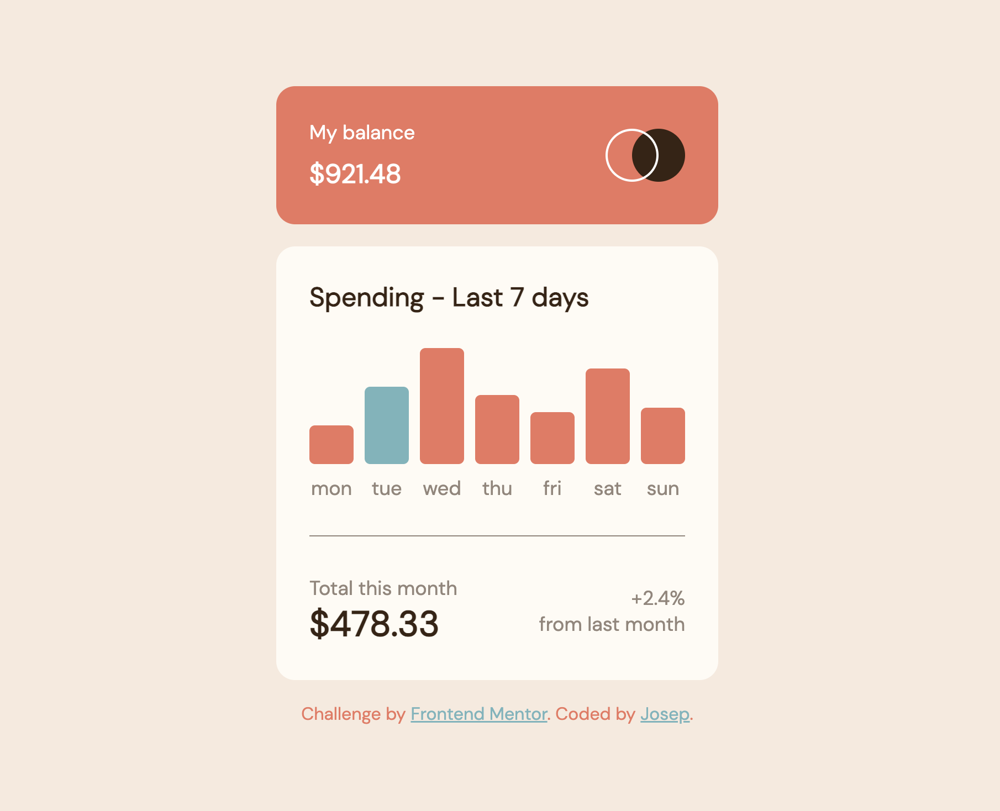

# Expenses chart component solution

This is a solution to the a basic chart element and weekly balance using HTML + CSS + JS

## Table of contents

- [The challenge](#the-challenge)
- [Screenshot](#screenshot)
- [Links](#links)
- [Built with](#built-with)
- [Author](#author)

### The challenge

Users should be able to:

- View the bar chart and hover over the individual bars to see the correct amounts for each day
- See the current day’s bar highlighted in a different colour to the other bars
- View the optimal layout for the content depending on their device’s screen size
- See hover states for all interactive elements on the page

### Screenshot

### Links

- Live Site URL: [https://josepabellana.github.io/ExpensesCard/](https://josepabellana.github.io/ExpensesCard/)

### Built with

- Semantic HTML5 markup
- CSS custom properties
- Flexbox
- CSS Grid
- Mobile-first workflow

## Author

- Website - [josep.abellana](https://www.josepabellana.com)
